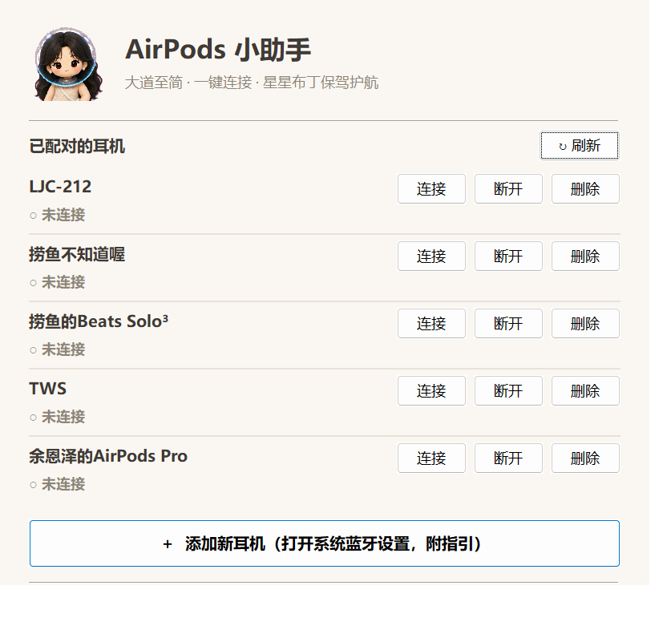
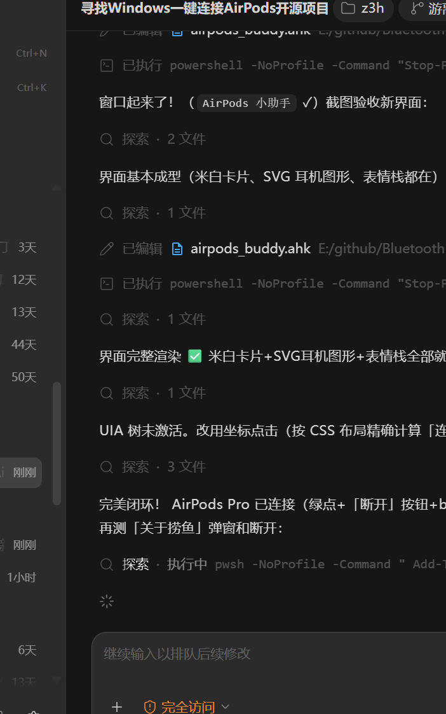

# 🎧 BluetoothDeviceConnector

<div align="center">
  
</div>

<div align="center">
  
  
  
</div>
<p align="center">
  
  
  
  
  
</p>
<p align="center">
  <a href="https://github.com/sponsors/ChromuSx"></a>
  <a href="https://ko-fi.com/chromus"></a>
  <a href="https://buymeacoffee.com/chromus"></a>
  <a href="https://www.paypal.com/paypalme/giovanniguarino1999"></a>
</p>
<p align="center">
  <strong>🔗 BluetoothDeviceConnector is an AutoHotkey script that connects or disconnects a paired Bluetooth audio device with either stereo-only playback or stereo plus microphone support.</strong>
</p>

## ✨ Features
- Automatically searches for the specified paired Bluetooth device.
- Connects or disconnects the device using editable defaults or command-line arguments.
- Selects **Stereo only (A2DP)** or **Stereo + microphone (A2DP + Hands-Free)**.
- Supports speaker-only devices that do not expose a Hands-Free profile.
- Provides visual notifications for success or errors.
- **🎮 Stream Deck Integration**: One-click Bluetooth connection directly from your Elgato Stream Deck!

## 🤍 AirPods Buddy — 米白简约风 GUI（fork 主打功能）

> 面向新手小白的「傻瓜式」AirPods 管理小助手：下载一个 exe，双击就能用。

<div align="center">
  
  <p><sub>米白配色 · 大道至简 · 星星布丁保驾护航</sub></p>
</div>

**功能一览**

- 🔍 **设备检测**：自动列出本机所有已配对的蓝牙耳机（AirPods / Beats / 其他耳机音箱）
- 🔗 **一键连接 / 一键断开**：每台设备独立按钮，连接后自动切换音频输出
- ➕ **添加指引**：一键打开系统蓝牙设置，并弹出保姆级指引（断开旧设备、进入待连接模式、各型号操作说明）
- 🗑️ **一键删除**：一站式移除不再使用的耳机设备
- 🔄 **自动更新**：启动时静默检查 GitHub 最新版本，落后即弹米白风更新窗，支持**一键自动更新**（下载→解压→自替换→重启，全程无需动手）；托盘菜单也可手动「检查更新」
- 🐟 **关于捞鱼**：右下角入口，粉丝群 / 赞赏码 / 星星布丁表情包三码齐飞

**使用方法**：下载 Release 里的 `AirPodsBuddy.exe`，双击运行（无需安装 AutoHotkey，资源已全部内嵌）。第一次使用请先在 Windows 蓝牙设置里完成一次配对，之后所有连接/断开都可以在小助手里一键完成。

源码为 `airpods_buddy.ahk`（AutoHotkey v2），也可直接用 AHK v2 运行。

<div align="center">
  
</div>

## 🖼️ Tray-Resident Variant (fork feature)

This fork adds **`bluetooth_tray_connector.ahk`** — a taskbar-resident version with a custom tray icon and a minimal right-click menu:

- **一键连接** (one-click connect) — double-clicking the tray icon works too
- **一键断开** (one-click disconnect)

Toast notifications report progress and results. All core connection logic is identical to the original one-shot script (`Bthprops.cpl\BluetoothSetServiceState`).

### Usage

1. Install [AutoHotkey v2](https://www.autohotkey.com/)
2. Edit the configuration block at the top of `bluetooth_tray_connector.ahk` (`deviceName`, `audioProfile`)
3. Run the script (or drop a shortcut into `shell:startup` to auto-start with Windows)

The custom tray icon is built with `make_ico.ps1` (PNG → multi-size ICO):

```powershell
pwsh ./make_ico.ps1 -Source "your-image.png" -Output "./assets/star_pudding.ico"
```

## 🎮 Stream Deck Plugin

This project includes an **official Stream Deck plugin** that lets you connect your Bluetooth devices with a single button press!

<div align="center">
  <a href="https://marketplace.elgato.com/product/bluetooth-device-connector-d7e642fc-1199-4ca0-9849-e303281dd07d">
    
  </a>
</div>

<div align="center">
  <a href="streamdeck-plugin/marketplace/promo.mp4"><strong>▶ Watch the updated 27-second promo (MP4)</strong></a>
</div>

### Quick Start
1. Install directly from the [Elgato Marketplace](https://marketplace.elgato.com/product/bluetooth-device-connector-d7e642fc-1199-4ca0-9849-e303281dd07d) or download from [GitHub Releases](https://github.com/ChromuSx/BluetoothDeviceConnector/releases/latest)
2. Add the "Connect Bluetooth Device" action to your Stream Deck
3. Pick your device and audio profile, then connect with one press!

### Features
- ✅ One-click connect/disconnect toggle
- 🔍 Device picker — choose a paired device from a dropdown in the Property Inspector
- 🎧 Per-key audio profile — choose stereo-only A2DP or stereo plus the Hands-Free microphone on Windows
- 🔁 Exclusive same-key handoff — changing a key's device disconnects its previous target before connecting the new one
- 🔊 Verified Windows audio routing — a successful connection selects and verifies the matching default playback endpoint, and tries the Hands-Free microphone when available
- 🔊 Speaker-only device support (Amazon Echo Dot, Bluetooth speakers, and devices without HFP)
- 📡 Safe restart state — Windows keys reapply their selected audio profile on the first press when device-wide Bluetooth status cannot prove the audio services are active
- 🎯 Visual feedback (Disconnected / Connecting / Connected / Error states)
- 🚀 Fast and lightweight

[→ Learn more about the Stream Deck plugin](streamdeck-plugin/)

## 🛠️ Requirements
- **Operating System**: Windows
- **Libraries**: The script uses the Bluetooth control library provided by Windows (`Bthprops.cpl`).
- **System Icon**: The script uses a system icon (requires the path `C:\WINDOWS\system32\netshell.dll`).
- **AutoHotkey v2**: Must be installed to run this script. [Download AutoHotkey v2](https://www.autohotkey.com/).

## 🚀 How to Use
1. **Install AutoHotkey v2**: Make sure AutoHotkey v2 is installed.
2. **Copy the code**: Copy the script code into `bluetooth_device_connector.ahk`.
3. **Run the script**: Double-click the `.ahk` file to run the script.

### ⚙️ Configuration
Modify the three variables at the beginning of the script. Existing behavior remains the default: connect `AirPods Pro` with stereo playback and its Hands-Free microphone enabled.

```ahk
deviceName := "AirPods Pro"
action := "connect"           ; "connect" or "disconnect"
audioProfile := "a2dp-hfp"   ; "a2dp" or "a2dp-hfp"
```

Use `audioProfile := "a2dp"` when you want stereo playback without enabling the Windows Hands-Free microphone profile.

The same values can be supplied without editing the file:

```powershell
AutoHotkey64.exe bluetooth_device_connector.ahk "Echo Dot" connect a2dp
AutoHotkey64.exe bluetooth_device_connector.ahk "AirPods Pro" disconnect a2dp-hfp
```

## 🧠 How It Works
The script uses the Windows Bluetooth Control Panel library (`Bthprops.cpl`) to find the desired device and manage two services:

- **Handsfree**: Connection for voice communications (e.g., calls).
- **AudioSink**: Connection for audio streaming (e.g., music).

Stereo-only mode disables Hands-Free before enabling AudioSink. Combined mode enables both services, while disconnect mode disables both. Devices that expose only one applicable audio service remain supported.

## 🔔 Notifications
The script will display notifications in case of:
- No Bluetooth device found.
- Device successfully connected or disconnected.
- Invalid action or audio-profile configuration.

## ⚠️ Limitations
- Each launch operates on one configured device; use command-line arguments or separate script copies for multiple targets.
- The standalone script manages Bluetooth services but does not change the Windows default playback endpoint. The Stream Deck plugin includes verified default-device routing.
- It works only on Windows, using the Bluetooth libraries provided by the operating system.

## 🛠️ Customization
You can customize the script to include more devices or add extra functionality. AutoHotkey is a versatile scripting language that allows you to automate many operations on Windows.

## 🤝 Contributions
Contributions and improvements are welcome! Feel free to submit a pull request or report any issues on [GitHub](https://github.com/ChromuSx/BluetoothDeviceConnector).

## 💖 Support the Project
This project is completely free and open source. If you find it useful and would like to support its continued development and updates, consider making a donation. Your support helps keep the project alive and motivates me to add new features and improvements!

<div align="center">
  <a href="https://github.com/sponsors/ChromuSx"></a>
  <a href="https://ko-fi.com/chromus"></a>
  <a href="https://buymeacoffee.com/chromus"></a>
  <a href="https://www.paypal.com/paypalme/giovanniguarino1999"></a>
</div>

Every contribution, no matter how small, is greatly appreciated! ❤️

## 🙏 致谢 Acknowledgements

- **[ChromuSx/BluetoothDeviceConnector](https://github.com/ChromuSx/BluetoothDeviceConnector)** — 本 fork 的核心连接/断开逻辑（`Bthprops.cpl\BluetoothSetServiceState`）与 Stream Deck 插件全部来自上游，由 Giovanni Guarino 以 MIT 协议开源。AirPods Buddy 的 GUI、托盘版与图标转换脚本是在此基础上的增强。强烈推荐去看看原项目！
- [AutoHotkey v2](https://www.autohotkey.com/) — 一切自动化的基石
- 星星布丁 — 界面吉祥物与表情包出处 💕

## 📜 License
This project is licensed under the MIT License. Feel free to use, modify, and distribute the script as you like.

<div align="center">
  <sub>Made with ❤️ by <a href="https://github.com/ChromuSx">Giovanni Guarino</a> · Fork features by <a href="https://github.com/lyzbcy">捞鱼 lyzbcy</a></sub>
</div>
